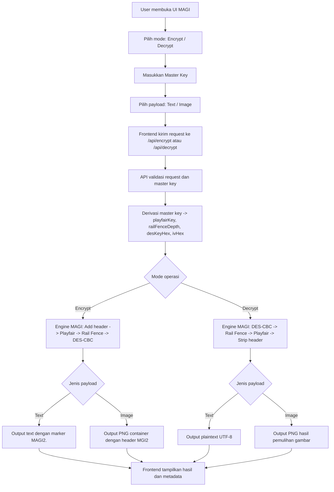

# PRODUCT REQUIREMENTS DOCUMENT (PRD)
**Nama Produk:** MAGI Cryptosystem (Super Encryption System)  
**Versi Dokumen:** 1.1.0  
**Penulis / Pengembang:** Ardika Putra Hadian (101032300240)  
**Mata Kuliah:** Keamanan Sistem, S1 Teknik Komputer, Universitas Telkom  
**Tanggal:** April 2026

---

## 1. Ringkasan Eksekutif (*Executive Summary*)
MAGI Cryptosystem adalah aplikasi web untuk mendemonstrasikan proses enkripsi dan dekripsi data teks maupun gambar menggunakan konsep *Super Encryption*. Sistem ini mempertahankan tiga algoritma utama yang disusun berlapis, yaitu Playfair Cipher, Rail Fence Cipher, dan DES dalam mode CBC. Seluruh algoritma inti tetap dibangun murni dari awal (*from scratch*) tanpa menggunakan *library* kriptografi pihak ketiga.

Pada versi implementasi saat ini, pengalaman pengguna telah disederhanakan. Pengguna tidak lagi memasukkan empat parameter kunci secara manual. Sebagai gantinya, pengguna cukup memasukkan satu *master key*. Sistem kemudian menurunkan *master key* tersebut secara deterministik menjadi parameter internal:

- `playfairKey`
- `railFenceDepth`
- `desKeyHex`
- `ivHex`

Dengan pendekatan ini, identitas akademik mesin kriptografi tetap dipertahankan, tetapi antarmuka menjadi lebih modern, ringkas, dan mudah dipakai.

---

## 2. Tujuan Proyek (*Project Objectives*)
- **Tujuan Akademik:** Memenuhi kebutuhan tugas CLO 1 Keamanan Sistem dengan implementasi kriptografi berlapis, mode non-ECB, serta dukungan untuk data teks dan gambar.
- **Tujuan Teknis:** Membangun aplikasi *full-stack* berbasis Next.js dengan frontend, API, dan mesin kriptografi yang saling terintegrasi dalam satu codebase.
- **Tujuan Pengguna:** Menyediakan antarmuka yang sederhana dan cepat dipahami, sehingga user cukup memasukkan satu *master key* untuk menjalankan seluruh pipeline MAGI.

---

## 3. Arsitektur Sistem (*System Architecture*)
Sistem menggunakan arsitektur *client-server* yang dijalankan dalam satu aplikasi Next.js.

- **Frontend (Presentasi & UI):**
  - Framework: Next.js (React) berbasis TypeScript
  - UI stack: Tailwind CSS, komponen kustom, Sonner untuk toast
  - Fungsi utama: menangani interaksi pengguna, validasi input, pemrosesan awal gambar di browser, dan menampilkan hasil
- **API Layer (Route Handlers):**
  - Framework: Next.js App Router Route Handlers
  - Endpoint utama:
    - `POST /api/encrypt`
    - `POST /api/decrypt`
    - `GET /api/health`
  - Fungsi utama: menerima request dari frontend, memvalidasi input, menurunkan *master key*, dan memanggil mesin MAGI
- **Cryptographic Engine (Backend Logic):**
  - Bahasa: TypeScript
  - Lokasi: `lib/magi`
  - Fungsi utama: menjalankan Playfair, Rail Fence, DES-CBC, SHA-256 from-scratch, dan pengemasan gambar terenkripsi

### Flowchart Sistem

---

## 4. Spesifikasi Mesin Kriptografi (*Cryptographic Engine Specification*)
Mesin utama (MAGI) dibagi menjadi tiga subsistem yang dieksekusi secara berurutan.

### Layer 1: Subsistem Melchior (Playfair Cipher)
- **Kategori:** Kriptografi klasik (*substitution cipher*)
- **Implementasi:** Byte-based Playfair 16x16
- **Logika:** Data dipecah menjadi pasangan byte (*bigram*) lalu disubstitusi berdasarkan tabel Playfair yang dibangun dari `playfairKey`

### Layer 2: Subsistem Balthasar (Rail Fence Cipher)
- **Kategori:** Kriptografi klasik (*transposition cipher*)
- **Implementasi:** Zigzag permutation berbasis byte array
- **Logika:** Byte dipetakan ke jalur zigzag berdasarkan `railFenceDepth`, lalu dibaca ulang per rail

### Layer 3: Subsistem Casper (DES dalam Mode CBC)
- **Kategori:** *Block cipher*
- **Implementasi:** DES-CBC from-scratch
- **Logika:** Data dipotong menjadi blok 64-bit, di-XOR dengan IV atau blok ciphertext sebelumnya, lalu diproses melalui 16 ronde Feistel, S-Box, P-Box, dan permutasi DES

### Derivasi Master Key
Sebelum data masuk ke tiga layer di atas, sistem menjalankan lapisan derivasi kunci:

- Input publik: `masterKey`
- Mesin derivasi: SHA-256 from-scratch
- Hasil turunan:
  - `playfairKey`
  - `railFenceDepth`
  - `desKeyHex`
  - `ivHex`

Derivasi ini bersifat deterministik. Artinya, *master key* yang sama akan selalu menghasilkan parameter internal yang sama.

### Marker Versi Payload
Untuk membedakan payload baru berbasis *master key*:

- Payload teks memakai marker: `MAGI2.`
- Payload gambar memakai header container: `MGI2`

Marker ini digunakan untuk validasi format pada saat dekripsi.

---

## 5. Kebutuhan Fungsional (*Functional Requirements*)

| ID | Nama Fitur | Deskripsi Fungsionalitas | Kriteria Penerimaan (*Acceptance Criteria*) |
| :--- | :--- | :--- | :--- |
| **FR-01** | **Pemilihan Mode Operasi** | Pengguna dapat memilih mode Enkripsi atau Dekripsi. | Sistem menyediakan *toggle* yang mengubah request ke `/api/encrypt` atau `/api/decrypt`. |
| **FR-02** | **Pemrosesan Data Teks** | Sistem menerima input teks, memprosesnya melalui pipeline MAGI, dan mengembalikan hasil sesuai mode. | Hasil encrypt teks berbentuk `MAGI2.<HEX>`. Hasil decrypt mengembalikan plaintext persis seperti semula. |
| **FR-03** | **Pemrosesan File Gambar** | Sistem menerima file `.png` atau `.jpg`, mengubahnya menjadi byte RGBA, lalu mengenkripsinya melalui pipeline MAGI. | Hasil encrypt gambar dibungkus menjadi PNG valid dengan header `MGI2`. Hasil decrypt harus menghasilkan gambar dengan piksel identik terhadap sumber. |
| **FR-04** | **Master Key Terpadu** | Pengguna cukup memasukkan satu *master key* untuk memulai operasi keamanan. | Sistem menurunkan *master key* secara deterministik menjadi `playfairKey`, `railFenceDepth`, `desKeyHex`, dan `ivHex` tanpa input manual tambahan dari user. |
| **FR-05** | **Auto-Downscale Resolusi** | Frontend memperkecil resolusi gambar besar secara otomatis saat mode encrypt. | Gambar dengan lebar/tinggi > 128px akan di-*resize* menjadi maksimum 128x128px sebelum dikirim ke API. |
| **FR-06** | **Validasi Marker Payload** | Sistem harus membedakan payload baru berbasis *master key* dari input biasa. | Dekripsi teks hanya menerima format `MAGI2.<HEX>`. Dekripsi gambar hanya menerima PNG dengan header `MGI2`. |
| **FR-07** | **Generate Secure Key** | Sistem menyediakan tombol untuk membuat *master key* acak yang siap dipakai. | Saat tombol ditekan, field `masterKey` terisi string acak valid dan dapat langsung dipakai untuk encrypt/decrypt. |

---

## 6. Kebutuhan Non-Fungsional (*Non-Functional Requirements*)
1. **Kinerja (Performance):** Dengan *auto-downscale* dan pipeline byte-based, proses enkripsi satu file gambar maksimum 128x128 px harus selesai dalam waktu yang wajar untuk demonstrasi kelas.
2. **Keandalan (Reliability):** API harus mengembalikan error HTTP 400 jika input tidak valid, misalnya *master key* kosong, marker `MAGI2` hilang, header `MGI2` tidak ditemukan, atau padding DES tidak valid.
3. **Konsistensi (Determinism):** *Master key* yang sama dan plaintext yang sama harus menghasilkan ciphertext yang sama, karena derivasi parameter internal dilakukan secara deterministik.
4. **Keamanan Implementasi (Implementation Security Constraint):** Sistem tidak menyimpan *master key*, parameter turunan, maupun file pengguna ke database atau penyimpanan permanen server.
5. **Keterbacaan Akademik (Academic Transparency):** Struktur kode harus tetap mudah dijelaskan per file, terutama pada modul `engine.ts`, `des.ts`, `sha256.ts`, `master-key.ts`, dan `image-codec.ts`.

---

## 7. Desain Antarmuka (*User Interface & Experience*)
- **Tema:** Monochrome hitam-putih dengan nuansa terminal/retro
- **Layout utama:**
  - Header: judul `MAGI CRYPT` dan statistik ringkas
  - Panel kiri: mode operasi, input `masterKey`, tombol show/hide, tombol generate key, status server
  - Panel kanan: *workspace* untuk payload teks atau gambar, tombol eksekusi, dan panel output
- **Feedback sistem:**
  - Toast sukses/gagal dengan Sonner
  - Overlay pipeline saat proses berjalan
  - Status server online/offline berbasis endpoint health check
- **Aksi utama user:**
  - memasukkan satu *master key*
  - memilih text/image payload
  - menjalankan encrypt/decrypt
  - mengunduh hasil PNG bila mode gambar

---

## 8. Di Luar Cakupan (*Out of Scope*)
1. Pemrosesan dokumen lain seperti video, audio, PDF, atau DOCX
2. Enkripsi gambar resolusi tinggi seperti 1080p atau 4K
3. Sistem login/autentikasi pengguna
4. Kompatibilitas dengan payload lama yang belum memakai marker `MAGI2` atau header `MGI2`

---

## 9. Kriteria Persetujuan Proyek (*Sign-off / Success Metrics*)
Proyek dianggap sukses dan siap dipresentasikan jika:

1. Algoritma inti Playfair, Rail Fence, DES-CBC, dan SHA-256 pada sistem aktif tetap ditulis manual tanpa *library* kriptografi pihak ketiga.
2. Aplikasi berhasil dijalankan dan diakses melalui browser.
3. Encrypt/decrypt teks dengan *master key* yang sama berhasil mengembalikan plaintext awal tanpa kehilangan data.
4. Encrypt/decrypt gambar berhasil mengembalikan dimensi dan piksel yang identik.
5. Marker `MAGI2` dan header `MGI2` tervalidasi dengan benar pada proses decrypt.
6. `npm run lint` dan `npm run build` berhasil dijalankan pada codebase final.

---

## 10. Catatan Implementasi Aktual
Berikut catatan penting agar PRD ini sinkron dengan implementasi saat ini:

- Backend aktif berada di Next.js App Router route handlers, bukan FastAPI
- *Master key* adalah satu-satunya input kunci yang diisi pengguna
- Parameter kunci lama tetap dipakai di dalam engine, tetapi hanya sebagai parameter internal hasil derivasi
- Output teks terenkripsi tidak lagi berupa hex polos, melainkan `MAGI2.<HEX>`
- Output gambar terenkripsi menggunakan PNG container valid dengan header `MGI2`
